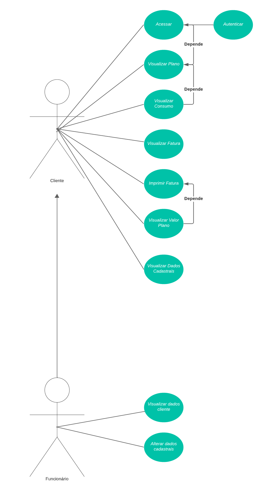

# Diagrama Casos de uso

#### O diagrama UML de casos de uso é uma ferramenta visual utilizada para descrever o comportamento funcional de um sistema a partir da perspectiva do usuário. Este tipo de diagrama mapeia as funcionalidades do sistema e como os usuários interagem com ele, destacando as ações disponíveis e suas possíveis sequências de uso.

#### No diagrama específico em questão, o ator "Cliente" representa os clientes da Vivo Móvel que interagem com o site da operadora. Após a autenticação, o cliente pode realizar várias ações, como visualizar detalhes do plano, consumo de dados, faturas e informações pessoais. Há também a opção de imprimir faturas, indicando a funcionalidade de geração de documentos.

#### Já o ator "Funcionário" simboliza os usuários internos do sistema, que têm acesso administrativo para visualizar e modificar os dados dos clientes. As ações disponíveis para este ator são relacionadas à gestão de informações cadastrais, permitindo a manutenção de registros de cliente e ajustes em seus planos de serviço.

