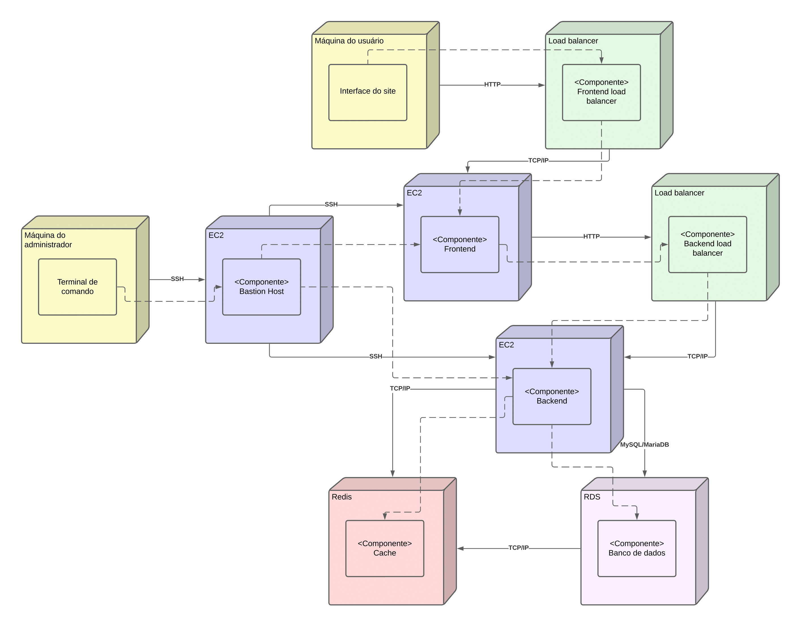

# Diagrama de implementação

Um diagrama de implementação UML, também conhecido como diagrama de implantação, é uma parte da Unified Modeling Language (UML) focada na representação física e na distribuição de componentes de software em uma infraestrutura de hardware. Ele mostra a configuração do hardware (nós) e como os componentes do software são distribuídos entre esses nós, destacando as relações físicas entre os elementos do sistema.

Para interpretar o diagrama, pode-se começar por dois lugares distintos. O primeiro dele sendo a máquina do usuário, que acessa o frontend a partir do load balancer. O frontend por sua vez passa também por um load balancer para fazer requisições pro back, e esse recupera as informações pedidas acessando o banco RDS ou o banco de cache.  
O segundo ponto de início é a partir da máquina do adminstrador. Ele não pode acessar diretamente as máquinas virtuais do frontend e backend, pois elas estão em uma subrede privada, sem acesso público. Com isso, o adminstrador acessa primeiro o BastionHost, e a partir desse se conecta nas instâncias de front e backend.