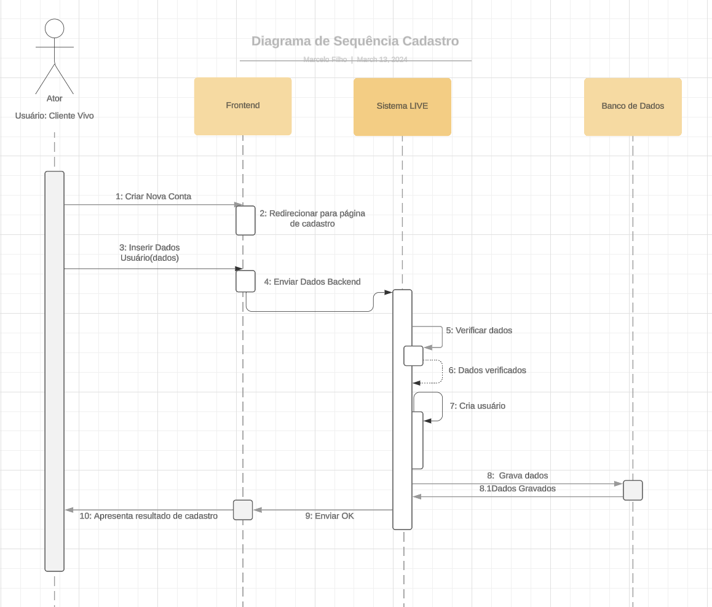
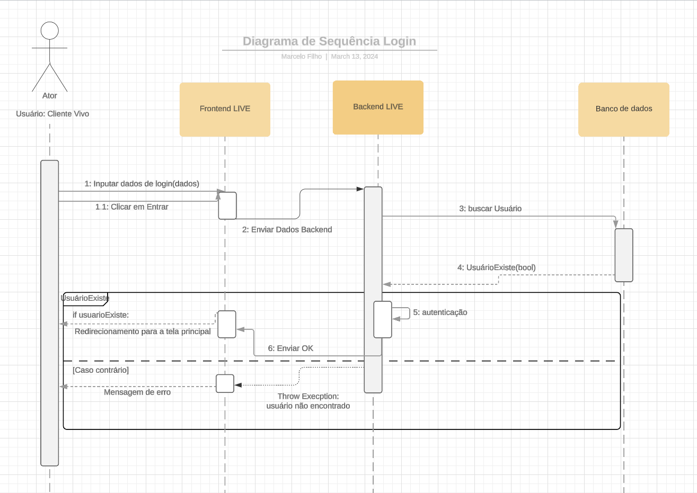
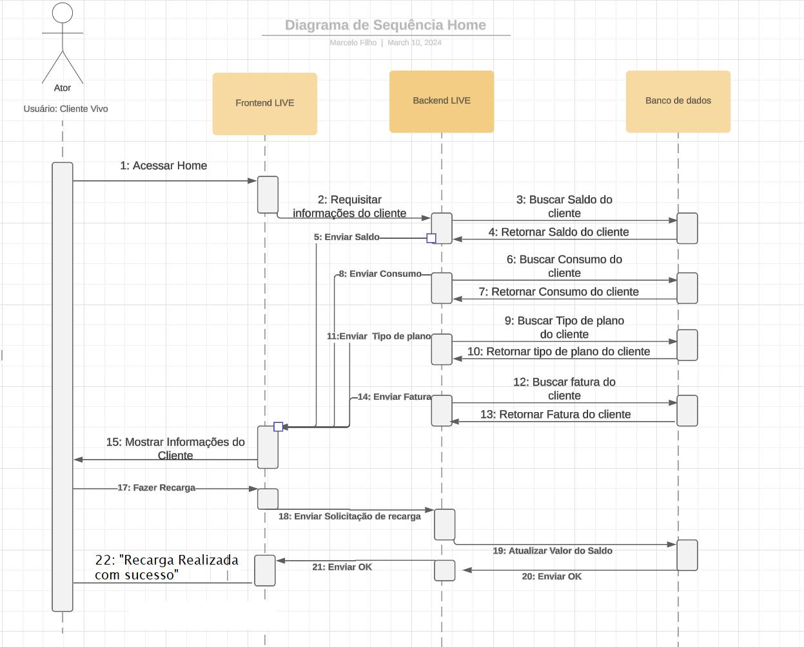

# Diagrama de sequência UML
De acordo com a IBM, um diagrama de sequência é um diagrama Unified Modeling Language (UML) que ilustra a seqüência das mensagens entre objetos em uma interação. Um diagrama de seqüência consiste em um grupo de objetos representados por linhas de vida e as mensagens que eles trocam durante a interação.

## Diagrama de sequência página login

O diagrama de sequência UML da página de login começa quando o usuário acessa a página e insere suas credenciais (número ou e-mail e senha). Após clicar em "Entrar", o frontend envia esses dados para o backend, que os utiliza para buscar o usuário no banco de dados. Se o usuário for encontrado, é realizada a autenticação com sucesso e ele é redirecionado para a página principal (home). Caso contrário, uma mensagem de erro é exibida na página de login.

## Diagrama de sequência página cadastro

No diagrama de sequência UML da página de cadastro, o usuário preenche os campos com seus dados e os envia. Esses dados são então verificados para garantir sua validade e, em seguida, são gravados no banco de dados para criar a nova conta do usuário.

## Diagrama de sequência página home

O diagrama de sequência UML da página home mostra o usuário acessando a página e visualizando suas informações, como saldo, número, CPF, consumo, fatura, etc. O usuário também tem a opção de recarregar seu saldo, atividade que ocorre quando ele clica no botão de recarga. Após a recarga, o saldo é atualizado e refletido na página.

observação: O botão de atualizar dados não foi incluido no  diagrama de sequência UML pois para ele estar funcional é necessário o desenvolvimento do cache, que será feito na sprint4