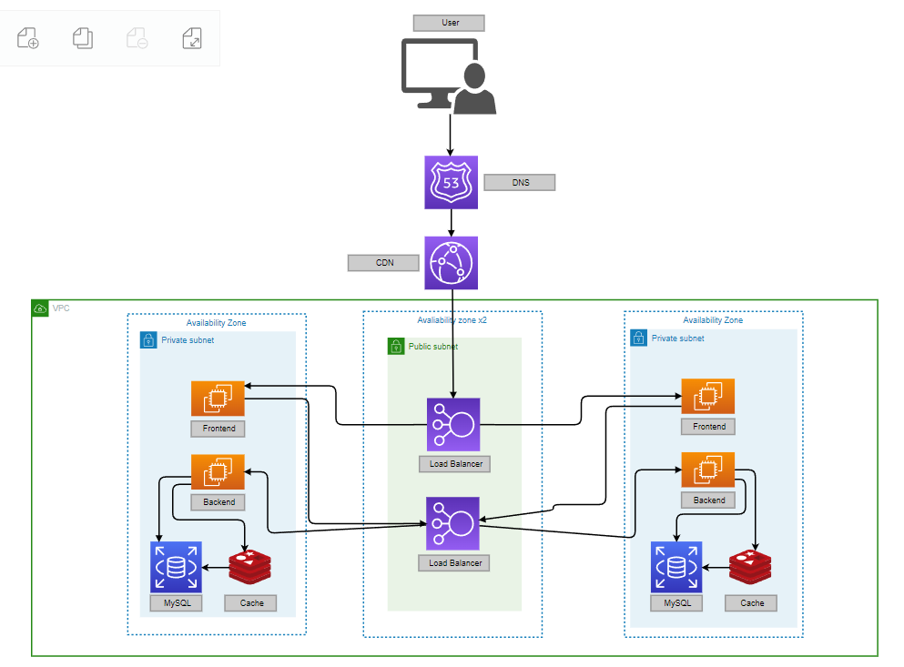
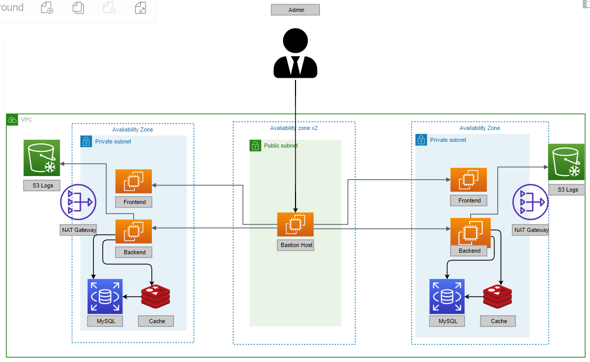

# Arquitetura Corporativa

Para facilitar a visualizização, a arquitetura foi dividida em dois diagramas, um para o usuário e outro para o administrador. Vale lembrar que a arquitetura no fundo é uma, essa divisão foi feita com o intuito de não poluir a imagem.
Além disso, vale ressaltar a presença das setas nos diagramas, já que a ideia é mostrar o fluxo indo do usuário / administrador (depende do diagrama) até os componentes. A seta pode ser interpretada como a palavra "acessa", então, usuário acessa DNS, DNS acessa CDN. Nem sempre é um acesso de fato, pode ser um encaminhamento de requisição, mas a ideia é mostrar a ordem de ativação dos componentes no fluxo.

### Compnonentes da arquitetura relevantes para o usuário

### Componentes da arquitetura corporativa relevantes para o administrador

## Componentes
### DNS:
Utiliza o serviço Route 53 para dar um nome de domínio à aplicação, tornando ela mais fácil de ser acessada pela web. Ele encaminha o usuário para o IP da aplicação, que resulta inicialmente na chegada da requisição do usuário à CDN

### CDN:
A CDN (Content Distribution Network) tem como função primária na aplicação a redução da latência de respostas para requisições vindas de localizações geograficamente distantes da nossa AWS Region. Ela salva temporariamente conteúdo estático em Edge Locations da AWS, espalhando esse conteúdo pelo globo, deixando ele mais perto dos usuários. Quando a requisição não pode ser satisfeita completamente pelo conteúdo estático salvo ele encaminha os pedidos para o Load Balancer do Frontend.

### Load Balancer Frontend:
Como a ideia é ter várias instâncias rodando o frontend da aplicação, a finalidade do Load Balancer é dividir o tráfego entre essas instâncias. Ele se conecta as instâncias do front a partir de um encaminhamento de requisições.

### EC2 Frontend:
A EC2 de frontend é quem cuida do visual da aplicação. Quando ela precisa de alguma informação do banco de dados, ou de algum serviço adicional, ela faz requisições http para o load balancer do backend

### Load Balancer Backend:
Como a ideia é ter várias instâncias rodando o backend da aplicação, a finalidade do Load Balancer é dividir o tráfego entre essas instâncias. Ele se conecta as instâncias do back a partir de um encaminhamento de requisições.

### EC2 Backend:
Esse EC2 é uma máquina rodando Amazon Linux que contém e executa o código do backend. Quando a requisição que chega para ela envolve consulta ao banco de dados, ele acessa o banco ou o cache por meio de uma conexão MySQL.

### Banco MySQL:
Utiliza o serviço RDS (Relational Database) da AWS e agrega as informações dos clientes. Ele atualiza o cache de 5 em 5 minutos.

### Redis Cache:
O Redis salva um cache do banco de dados que é atualizada de 5 em 5 minutos. O backend idealmente realiza as consultas aqui, mas caso o usuário pressione o botão de atualizar, ele busca direto do banco RDS.

### EC2 Bastion Host:
Como as instâncias do backend e frontend estão em sub-redes privadas, elas não podem ser acessadas diretamente pelo administrador. O administrador deve primeramente acessar o Bastion Host via ssh, e, de lá, garantindo a presença da chave .pem de segurança, acessar, também via ssh, a instância desejada, seja ela back ou front.

### NAT Gateway:
Se conecta às sub-redes privadas via tabela de rotas, e a finalidade dessa conexão é permitir que as sub-redes privadas tenham acesso a internet para baixar atualizações, etc., mas sem permitir que a internet tenha acesso a elas. Ela concentra as requisições de todas as instâncias da sub-rede sob um único IP público.

### S3 Logs:
Hospedado em um S3 Standart, por falta de acesso ao Glacier, o S3 Logs guarda os logs enviados pelo backend, para garantir a governança e permitir futura análise.

## Benefícios da arquitetura

### Balanceamento de carga:
O Load Balancer garante que as requisições sejam divididas entre várias instâncias, impedindo que alguma instância específica fique sobrecarregada.

### Capacidade de failover:
Como as instâncias estão divididas em várias zonas de disponibilidade, que estão a centenas de quilômetros de distância, isso garante que, mesmo que hajam problemas ou desastres em uma zona, o sistema pode continuar operando, e terá a persistência dos dados, já que há mais de um banco de dados, levando a redundância e possibilidade de backup.

### Elasticidade:
A arquitetura é extremamente paralela, no sentido de que, caso haja necessidade de escalar a aplicação, basta abrir mais instâncias e atrelá-las ao respectivo Load Balancer.

### Possibilidade de avaliação de desempenho:
Além da possibilidade de avaliação imediata de desempenho utilizando bibliotecas de teste, a aplicação garante a geração e armazenamento de logs relativos a sua performance, permitindo análise futura.