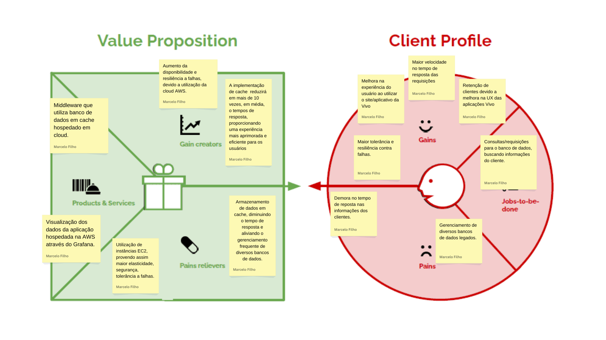
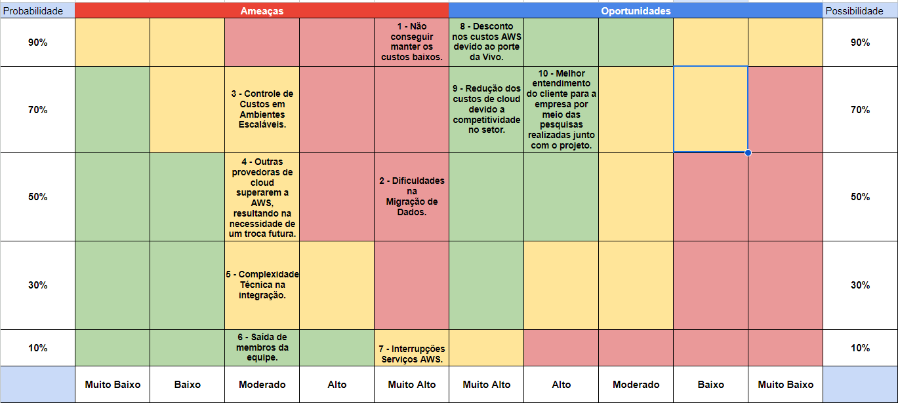

# Entendimento de Negócio

## Canvas Proposta de Valor
 O Canvas Proposta de Valor é uma forma de analisar o consumidor, entendendo suas dores e necessidades, mas também analisa a solução, tendo em vista que também serão desenvolvidos os produtos e serviços, aliviadores das dores e também os criadores de ganho. Dessa forma, essa é uma ferramenta muito importante no entendimento de negócio.

 

## Análise de Oceano Azul

A Análise de Oceano Azul é uma abordagem estratégica desenvolvida para ajudar organizações a se afastarem das competições acirradas dos "oceanos vermelhos", caracterizados por mercados saturados onde as empresas lutam por uma parcela de mercado cada vez menor. Em contraste, o Oceano Azul incentiva a busca por espaços de mercado inexplorados, ou "oceanos azuis", onde a concorrência é irrelevante porque as regras do jogo ainda não foram estabelecidas.

A estratégia do Oceano Azul foca em quatro ações principais para redefinir as fronteiras do mercado: Reduzir, Eliminar, Aumentar e Criar. Estas ações visam modificar os atributos do produto ou serviço de uma forma que cria novo valor para os clientes e para a empresa, abrindo novos espaços de mercado e oportunidades para crescimento sustentável.

### Ações Estratégicas

#### Reduzir

- **Latência nas Consultas**: Implementar cache eficiente na cloud para diminuir o tempo de resposta das consultas.

- **Dependencia a base de dados legada**: Implementar soluções de cache, para armazenar dados frequentemente acessados, reduzindo a necessidade de consultas diretas às bases de dados legadas.

#### Eliminar

- **Parte do turnover de clientes**: Acabar com turnover de clientes devido a demoras e travamentos.

- **Escalabilidade Limitada**: Superar as limitações de escalabilidade das bases de dados legadas, empregando soluções de banco de dados na nuvem que oferecem ima maior escalabilidade.

#### Aumentar

- **Satisfação do Cliente**: Aprimorar a percepção e a satisfação do cliente em relação ao tempo de resposta do aplicativo.

- **Tolerância a falhas**: As bases de dado na nuvem são mais modernas e possuem mais mecânismos de redundância e tolerância a falhas.

#### Criar

- **Fluidez de navegação**: Com o tempo mais rápido de resposta, espera-se que a navegação do cliente pelo aplicativo seja mais fluída.

- **Backup dos dados**: Passar os dados para a cloud torna-se é uma medida de segurança, sendo um backup a mais

### Comparativo com concorrentes

Em comparação com seus principais concorrentes no segmento de telefonia móvel – Claro, Oi, e TIM –, a Vivo se destaca por sua capacidade de entregar uma experiência de cliente diferenciada, ancorada em sua ampla cobertura nacional e investimentos contínuos em tecnologia, como a implantação da rede 5G. Enquanto a indústria enfrenta desafios comuns relacionados à satisfação do cliente e questões técnicas, a Vivo tem conseguido manter um alto padrão de qualidade e confiabilidade em seus serviços móveis. Este foco na qualidade e na inovação tecnológica posiciona a Vivo de maneira única para explorar novos espaços de mercado, diferenciando-se da Claro, que tem se concentrado em oferecer pacotes de dados competitivos[6], da Oi, que busca recuperação financeira e reestruturação de seus serviços[3], e da TIM, reconhecida por seus esforços em expandir a cobertura 4G e iniciar a implementação do 5G[6]. A Vivo, portanto, tem a oportunidade de alavancar esses pontos fortes para capturar e reter clientes que valorizam uma conexão móvel estável e de alta velocidade, além de serviços inovadores e de alta qualidade.

#### Claro Móvel
A Claro é reconhecida por sua cobertura ampla e pelo investimento constante em tecnologia, como o 5G, posicionando-se como líder em inovação no segmento móvel. Comparada à Vivo, a Claro tem um foco agressivo em pacotes de dados generosos e parcerias com serviços de streaming, atraindo um público jovem e tecnologicamente engajado. A Vivo Móvel, por sua vez, compete com uma estratégia de valor agregado, enfatizando a qualidade do serviço e a experiência do usuário, além de uma ampla cobertura nacional. A Vivo pode se diferenciar ainda mais ao fortalecer seus serviços exclusivos e programas de fidelidade para reter e atrair clientes que valorizam a qualidade e a confiabilidade sobre tudo.

#### TIM Móvel
A TIM se destaca pela oferta de planos com foco em internet móvel de alta velocidade e pela estratégia de preços competitivos, particularmente nos planos controle e pré-pagos. A empresa é frequentemente citada por seu compromisso com a expansão da cobertura 4G em áreas rurais e regiões menos atendidas. Em comparação, a Vivo Móvel se posiciona como uma operadora premium, com ênfase na qualidade do sinal e no atendimento ao cliente. Para competir efetivamente com a TIM, a Vivo pode explorar oportunidades para melhorar sua acessibilidade e oferta de planos mais flexíveis, atendendo às necessidades de um espectro mais amplo de clientes.

#### Oi Móvel
A Oi, em processo de reestruturação, tem enfrentado desafios significativos, mas continua a ser uma concorrente no mercado móvel, especialmente em regiões onde possui forte presença de infraestrutura. Seu foco tem sido em oferecer soluções de valor para o segmento de entrada, com planos acessíveis e benefícios em chamadas e mensagens. A Vivo Móvel, com sua rede robusta e serviços diversificados, pode capitalizar sobre as incertezas da Oi oferecendo transições facilitadas para clientes da Oi que buscam maior estabilidade e um espectro mais amplo de serviços.

## Matriz de Riscos

### Descrição dos Riscos / Oportunidades

1. **Não conseguir manter os custos baixos**
   - *Descrição*: Não conseguir manter o projeto dentro da expectativa de custos do cliente.

2. **Dificuldades na Migração de Dados**
   - *Descrição*: A migração de dados para a nova solução pode enfrentar desafios, como incompatibilidade de formatos e risco de perda de dados, complicando a transição.

3. **Controle de Custos em Ambientes Escaláveis**
   - *Descrição*: O gerenciamento inadequado de recursos escaláveis na infraestrutura da AWS pode resultar num aumento inesperado de custos.

4. **Outras provedoras de cloud superarem a AWS**
   - *Descrição*: Hoje a AWS é referência na área, mas futuramente pode surgir uma opção que supere ela, tornando uma troca de provedora necessária.

5. **Complexidade Técnica na Integração**
   - *Descrição*: Desafios na integração da nuvem com sistemas existentes podem causar incompatibilidades e problemas de desempenho.

6. **Saída de membros da equipe**
   - *Descrição*: A equipe atual já possui um tamanho pequeno (5 membros), a saída de algum deles representa uma ameaça ao desenvolvimento do projeto, podendo atrasá-lo e reduzir sua expectativa de qualidade.

7. **Interrupções dos serviços AWS**
   - *Descrição*: Apesar de extremamente improvável, devido ao tamanho da empresa, a interrupção dos serviços AWS seria um enorme problema para o projeto, representando risco aos dados lá hospedados e atrasando o desenvolvimento, devido à necessidade de mudança da provedora de cloud em questão.

8. **Desconto nos custos AWS devido ao porte da vivo**
   - *Descrição*: Como a Vivo é uma empresa muito grande, há uma enorme chance de ela obter descontos na hospedagem em nuvem, já que provavelmente moveria dados em atacado. Isso seria muito benéfico para o projeto, já que custos são uma questão muito importante.

9. **Redução dos custos devido a competitividade no setor**
   - *Descrição*: O setor de cloud já é extremamente competitivo e a tendência é isso só aumentar, já que cada vez mais entram mais players no mercado, a própria Vivo por exemplo. Essa alta competitividade tende a resultar em uma redução de custos na tentativa das provedoras de atrair mais clientes.

10. **Melhor entendimento do cliente por parte da empresa**
   - *Descrição*: Em associação com o projeto foi realizada uma pesquuisa qualiquantitativa, o que é uma oportunidade de agregar valor para a empresa para além do que foi pedido no projeto, a partir de um melhor entendimento do usuário.

## Análise Financeira do projeto

No contexto do projeto, a empresa parceira em questão é a Vivo, no entanto, por falta de informações e dados relevantes, a análise financeira acaba por torna-se uma estimativa baseada em um cenário de escala local e de escala geral, trazendo assim dois valores. Primeiro a análise financeira foi feita baseada nas limitações do projeto em questão de infraestrutura, capital disponível, objetivos gerais e tamanho do projeto. Em seguida houve o cálculo da escalabilidade em mil vezes, de modo que pudesse haver uma estimativa mais próxima do que o parceiro utilizaria.

Nesta análise, exploramos o custo envolvido na implementação e escalonamento de uma infraestrutura na AWS para um projeto que inclui um banco de dados relacional, armazenamento de objetos, computação e cache Redis. Os custos são apresentados em reais (R$) e refletem uma infraestrutura configurada para operar 24/7.

Configuração Inicial
A configuração inicial contempla as seguintes necessidades e seus respectivos custos mensais:

Banco de Dados Relacional (RDS) com PostgreSQL, 100GB, utilizando uma instância t3.medium: R$ 183,00.
Armazenamento de Objetos (S3) para 50GB no padrão Standard: R$ 2,75.
Computação (EC2) com 2 instâncias t3.medium: R$ 366,00.
Cache Redis (ElastiCache) usando uma instância cache.t3.medium: R$ 157,50.
O custo total mensal para a configuração inicial é de R$ 709,25, o que representa um investimento viável para startups ou pequenas e médias empresas (PMEs) buscando soluções escaláveis e robustas na nuvem.

### Custos de Mão de Obra
Incluímos os custos para uma equipe composta por um Scrum Master e seis desenvolvedores (três júnior e três sênior), calculando o custo total baseado em salários por hora e uma jornada de 160 horas mensais.

Scrum Master: R$5.600/mês
Desenvolvedores Júnior: R$16.800/mês (total para 3)
Desenvolvedores Sênior: R$21.600/mês (total para 3)
Custo Total de Mão de Obra: R$44.000/mês

####  Funcionalidades

##### Banco de Dados Relacional (RDS) com PostgreSQL
O serviço de Banco de Dados Relacional (RDS) da AWS oferece uma solução gerenciada para operar bancos de dados como PostgreSQL, facilitando tarefas como provisionamento de hardware, configuração de banco de dados, patching de software e backups. Ao optar pelo RDS com uma instância t3.medium e 100GB de armazenamento, o projeto visa fornecer uma infraestrutura de banco de dados robusta, escalável e de alta disponibilidade por R$ 183,00 mensais. Esse investimento suporta a operação 24/7 necessária para aplicações críticas, garantindo desempenho estável e segurança para dados de usuários, como faturas, uso de dados e informações de planos de uma operadora de telefonia móvel. A escolha pelo PostgreSQL combina a confiabilidade de um sistema de gerenciamento de banco de dados relacional com a flexibilidade de suporte a cargas de trabalho complexas e grandes volumes de dados.

##### Armazenamento de Objetos (S3)
O Amazon S3 fornece um serviço de armazenamento de objetos altamente durável, escalável e acessível, ideal para uma ampla variedade de casos de uso, como backups, arquivos estáticos para aplicações web e big data. Com um custo de R$ 2,75 para 50GB no padrão Standard, o S3 é uma escolha econômica para armazenar grandes volumes de dados com a flexibilidade de acesso de qualquer lugar. O serviço oferece facilidades como controle de acesso fino, criptografia, e outras políticas de segurança, garantindo que os dados estejam seguros e disponíveis quando necessário. Este custo-benefício torna o S3 uma solução atraente para empresas que buscam eficiência e escalabilidade no armazenamento de dados.

##### Computação (EC2)
O Amazon EC2 proporciona capacidade computacional escalável na nuvem, permitindo aos usuários alugar servidores virtuais para rodar aplicações. Com 2 instâncias t3.medium operando 24/7 por um custo mensal de R$ 366,00, o projeto se beneficia da flexibilidade para escalar recursos conforme a demanda. Essas instâncias são adequadas para hospedar aplicações web e bancos de dados em memória como Redis, oferecendo um equilíbrio entre capacidade de processamento, memória e rede para uma ampla gama de aplicações. Este investimento assegura a disponibilidade e a performance necessárias para atender às demandas dos usuários finais, mantendo o sistema responsivo e eficiente.

##### Cache Redis (ElastiCache)
O Amazon ElastiCache para Redis é um serviço que facilita a implantação, operação e escalabilidade de um armazenamento de dados em memória na nuvem, ideal para casos de uso como caching, sessões de usuário e tabelas de liderança em jogos. Por R$ 157,50 mensais, a instância cache.t3.medium oferece um sistema de cache robusto, reduzindo a latência e o throughput, ao armazenar cópias de dados frequentemente acessados em memória. Isso permite consultas mais rápidas que aprimoram a experiência do usuário ao acessar informações como faturas e uso de dados. A escolha por Redis combina performance com simplicidade, suportando estruturas de dados ricas e mecanismos de persistência que asseguram a integridade dos dados em cenários de alta demanda.

Cada componente da infraestrutura AWS foi escolhido com objetivos claros: o RDS para gerenciamento de dados confiável e escalável, o S3 para armazenamento econômico e acessível, o EC2 para computação flexível e adaptável, e o ElastiCache para acesso rápido a dados e melhor experiência do usuário. Juntos, esses serviços formam uma fundação sólida para aplicações exigentes, equilibrando custo, desempenho e escalabilidade.

#### Escalamento do Projeto
Ao escalar o projeto em 1000 vezes, considerando um crescimento exponencial na demanda ou a necessidade de expansão significativa dos serviços, os custos ajustam-se da seguinte forma:

Banco de Dados Relacional (RDS) agora requer 100.000GB de armazenamento, elevando o custo para R$ 183.000,00.
Armazenamento de Objetos (S3) aumenta para 50.000GB, com um custo ajustado para R$ 275,00. Este valor relativamente baixo em comparação com outros componentes destaca a eficiência do S3 para armazenamento em grande escala.
Computação (EC2), com a necessidade de 2000 instâncias t3.medium, tem seu custo elevado para R$ 366.000,00.
Cache Redis (ElastiCache), ao escalar para 1000 instâncias cache.t3.medium, incide em R$ 157.500,00.
O custo total para a infraestrutura escalada atinge R$ 706.775,00 mensais, indicativo do significativo investimento necessário para suportar uma operação de grande escala na AWS. Este valor reflete não apenas o aumento na capacidade de armazenamento e processamento, mas também a necessidade de uma gestão eficiente de recursos para otimizar custos.

## Referências

[1] "Vivo Fibra: Não contrate antes de ler isso - Pontos positivos e negativos." Reclame Aqui. Disponível em: https://www.reclameaqui.com.br/vivo-celular-fixo-internet-tv/vivo-fibra-nao-contrate-antes-de-ler-isso-pontos-positivos-e-negativos_WXXrqi9bUctbUsSk/

[2] "As pequenas rivais da Claro Virtua, Vivo Fibra e Oi Fibra estão unindo forças." Tecnoblog. Disponível em: https://tecnoblog.net/especiais/as-pequenas-rivais-da-claro-virtua-vivo-fibra-e-oi-fibra-estao-unindo-forcas/

[3] "Maiores empresas do Brasil em telecomunicações." Econodata. Disponível em: https://www.econodata.com.br/maiores-empresas/todo-brasil/telecomunicacoes

[4] "Vivo é a marca com mais comentários negativos na web." Exame. Disponível em: https://exame.com/marketing/vivo-e-a-marca-com-mais-comentarios-negativos-na-web/

[5] "Concorrentes vão pagar R$ 16,5 bilhões e partilhar Oi." Exame. Disponível em: https://exame.com/negocios/concorrentes-vao-pagar-r-165-bilhoes-e-partilhar-oi/

[6] "Veja as melhores operadoras de celular do Brasil." Tecnoblog. Disponível em: https://tecnoblog.net/noticias/2023/07/20/veja-as-melhores-operadoras-de-celular-do-brasil/