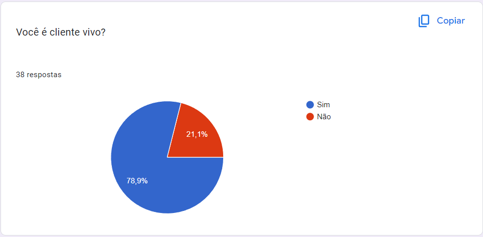
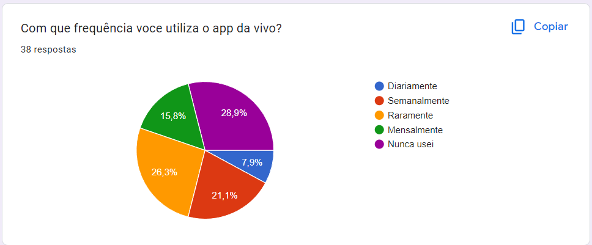
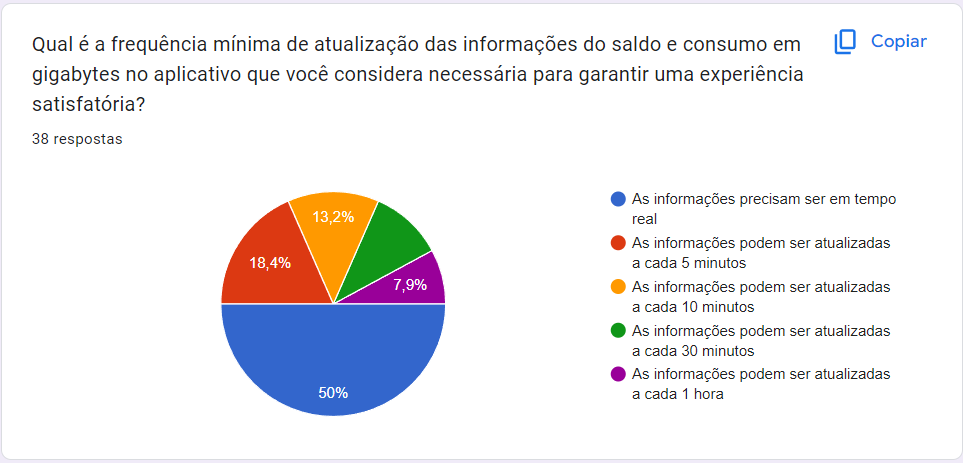
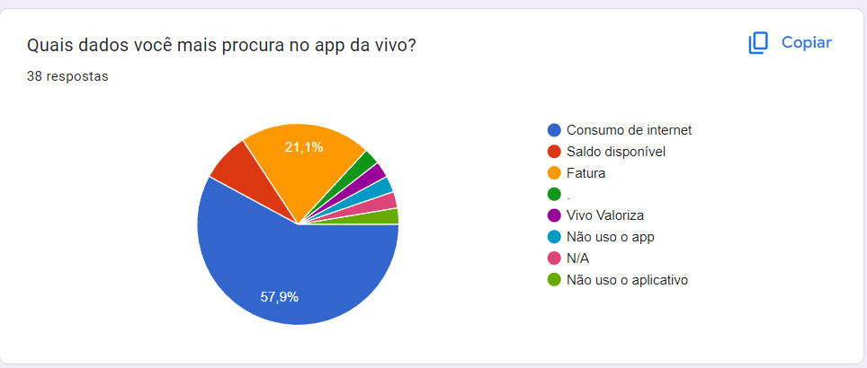
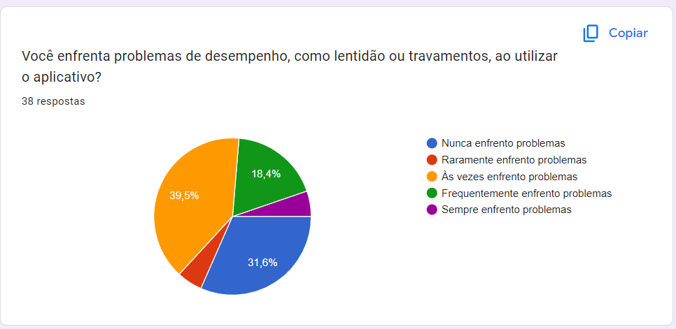
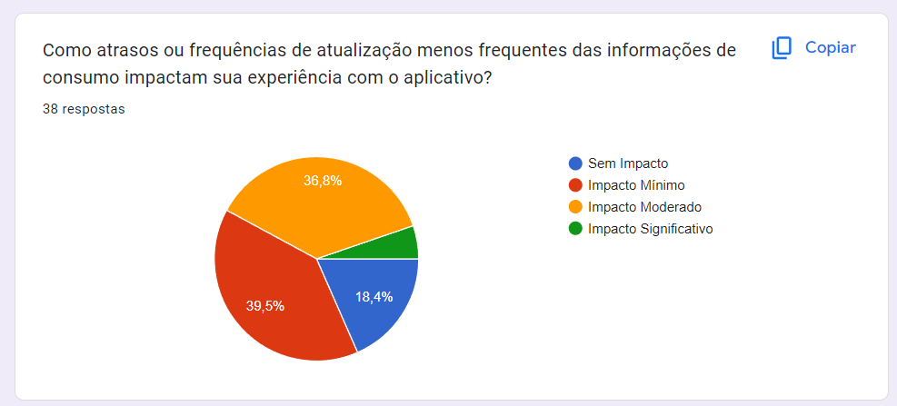
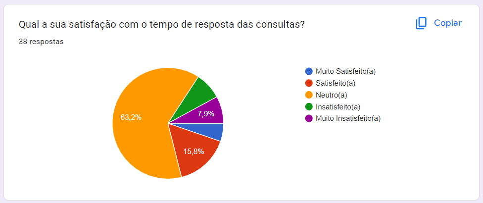
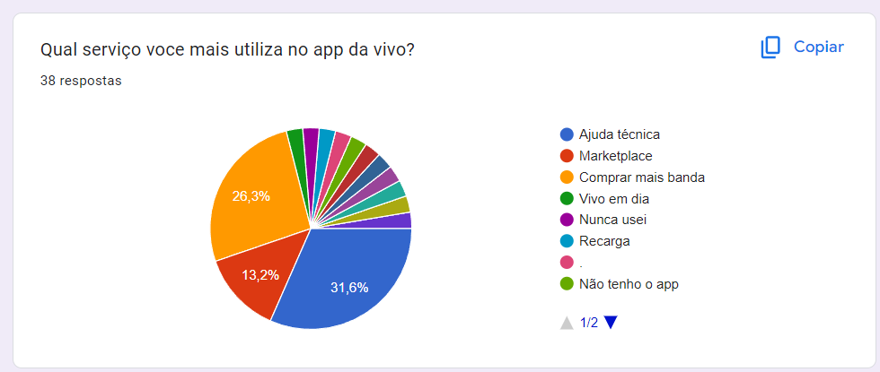
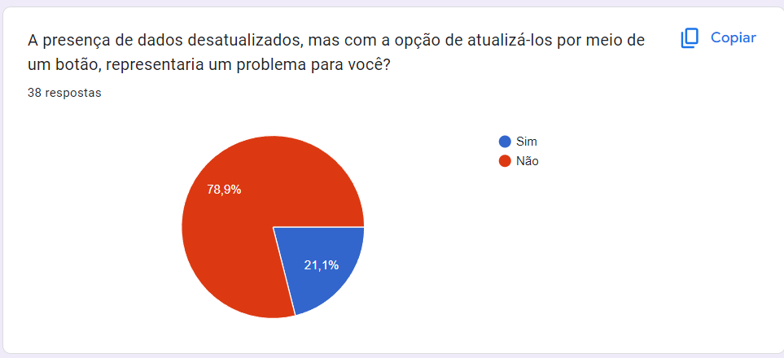

# Introdução

Com o intuito de verificar e validar alguns conceitos e percepções a respeito de hábitos dos consumidores e tipos de consumo por parte dos usuários, foi desenhado e desenvolvido um formulário. A pesquisa a base do formulário contempla opções de respostas que ajudam a compreender quem são os clientes da Vivo, tal como seus hábitos de consumo, forma de aquisição, preferências de usabilidade. Por meio da lógica e pesquisa de serviços oferecidos pela operadora, aliando essas informações aos objetivos do trabalho da equipe que criou a pesquisa, tornou-se possível analisar de maneira tangível e esclarecedora os tipos de consumidores de operadoras de telecomunicação. Essa pesquisa teve como principal objetivo, coletar dados que permitissem estimar com maior precisão as divisões de consumo por parte dos clientes, principais serviços adquiridos e a adaptação dos clientes ao aplicativo único “Meu vivo” que engloba uma série de serviços que o cliente usa para seu controle de gastos, serviços de aquisições, entre outros.

A pesquisa quali-quantitativa foi elaborada e aplicada por meio de um formulário online, utilizando uma plataforma de formulários digitais para garantir uma ampla participação e facilidade de acesso. O questionário foi desenhado para abordar aspectos qualitativos e quantitativos da experiência dos usuários com o aplicativo da Vivo, incluindo questões sobre frequência de uso, satisfação com o tempo de resposta das consultas, atualização das informações de consumo e desempenho do aplicativo. Após a criação, o formulário foi distribuído para um grupo diversificado de indivíduos, potenciais usuários do aplicativo, visando obter uma variedade de perspectivas e insights. Essa abordagem permitiu uma coleta de dados abrangente e representativa, facilitando a análise de tendências, preferências e áreas de melhoria para enriquecer a experiência do usuário com o aplicativo da Vivo.

# Imersão Preliminar

A imersão foi realizada por meio de workshops com o parceiro. Inicialmente, houve uma palestra institucional, que começou com Rebeca, da área de Employer Branding da Vivo, explicando um pouco mais a fundo sobre a empresa. Essa parte foi importante para ressaltar que a Vivo não é só uma empresa provedora de dados, mas também provedora de cloud, marketplace, streaming, entre outros.

Nesse contato inicial, também estavam presentes convidados mais técnicos como Tatiana, Gerente de Soluções e Cloud, Primo, Gerente de Capacidade e Performance, Perin, Especialista de Transformação Digital, e Yasmin, Estagiária da área. Eles puderam dar detalhes mais técnicos da empresa, como o porquê da Vivo também ser cloud, e a quantidade de dados que a empresa precisa gerenciar diariamente.

O contato seguinte já foi mais relacionado ao projeto em si. Começou com o parceiro explicando melhor a proposta, indicando que o objetivo principal era alcançar uma solução que trouxesse rapidez, escalabilidade, estabilidade e segurança, mantendo ainda o baixo custo. Para isso, o ideal seria conseguir acessar as informações necessárias sem ter que consultar as bases de dados legadas diretamente, garantindo um tempo de disponibilização do dado ao cliente de 3 segundos ou menos. Além disso, nos foram passados alguns dos principais objetivos para o desenvolvimento dessa aplicação, estes foram: Melhora na experiência do cliente, velocidade na entrega da informação e mensurar o ganho na UX. Ademais, nos foi colocada a seguinte indagação: como escalar nosso barramento de dados legado através da Cloud mantendo a viabilidade econômica?

Antes do workshop, o grupo havia refletido bastante sobre o problema e possíveis soluções, através de conversas com os professores de programação e pesquisas a respeito de problemas semelhantes. Com isso, preparamos uma proposta de solução inicial, que consistia em passar as informações dos bancos legados para a nuvem, o que reduziria a latência, aumentaria a escalabilidade, além de prover uma maior tolerância a falhas e elasticidade. O feedback do parceiro para essa proposta foi crucial, tendo em vista que ele apontou o alto custo atrelado a mesma, demonstrando que seria muito difícil de ela ser implementada na prática. Isso levou a muita reflexão e trouxe como resultado a solução atual, que usa cache na nuvem ao invés de passar os diversos bancos legados, proporcionando, dessa maneira, maior viabilidade econômica.

De um modo geral, a imersão preliminar foi fundamental para entender mais profundamente o problema, mas também para encontrar a direção correta logo no início do projeto, garantindo que uma solução custosa e inviável não fosse posta em prática, o que, futuramente, acarretaria na necessidade de pivotar. É válido afirmar que esse contato inicial economizou duas semanas de desenvolvimento visto que, se não por ele, o grupo só teria recebido esse valioso retorno no final da primeira sprint.

# Análise do Resultado da Pesquisa

Com o intuito de verificar e validar alguns conceitos e percepções a respeito de hábitos dos consumidores e tipos de consumo por parte dos usuários, foi desenhado e desenvolvido um formulário. A pesquisa a base do formulário contempla opções de respostas que ajudam a compreender quem são os clientes da Vivo, tal como seus hábitos de consumo, forma de aquisição, preferências de usabilidade. Por meio da lógica e pesquisa de serviços oferecidos pela operadora, aliando essas informações aos objetivos do trabalho da equipe que criou a pesquisa, tornou-se possível analisar de maneira tangível e esclarecedora os tipos de consumidores de operadoras de telecomunicação. Essa pesquisa teve como principal objetivo, coletar dados que permitissem estimar com maior precisão as divisões de consumo por parte dos clientes, principais serviços adquiridos e a adaptação dos clientes ao aplicativo único “Meu vivo” que engloba uma série de serviços que o cliente usa para seu controle de gastos, serviços de aquisições, entre outros.

A pesquisa quali-quantitativa foi elaborada e aplicada por meio de um formulário online, utilizando uma plataforma de formulários digitais para garantir uma ampla participação e facilidade de acesso. O questionário foi desenhado para abordar aspectos qualitativos e quantitativos da experiência dos usuários com o aplicativo da Vivo, incluindo questões sobre frequência de uso, satisfação com o tempo de resposta das consultas, atualização das informações de consumo e desempenho do aplicativo. Após a criação, o formulário foi distribuído para um grupo diversificado de indivíduos, potenciais usuários do aplicativo, visando obter uma variedade de perspectivas e insights. Essa abordagem permitiu uma coleta de dados abrangente e representativa, facilitando a análise de tendências, preferências e áreas de melhoria para enriquecer a experiência do usuário com o aplicativo da Vivo.

## Resultados

Com base no gráfico fornecido, a maioria dos respondentes, representando 78,9%, são clientes da Vivo, enquanto 21,1% não são. Isso indica que a pesquisa alcançou predominantemente o público-alvo de usuários atuais do aplicativo, o que pode fornecer insights valiosos sobre a experiência real dos clientes

O gráfico sugere que 29% dos respondentes nunca usaram o app da Vivo, enquanto 25% o utilizam raramente. Aproximadamente 21% dos usuários acessam o aplicativo semanalmente e 16% mensalmente. Uma fração menor, de 8%, usa o app diariamente, indicando uma distribuição variada na frequência de uso entre os usuários.

Metade dos usuários espera atualizações em tempo real no app da Vivo para uma boa experiência. Outros preferem atualizações frequentes, variando de 5 a 10 minutos, enquanto poucos estão satisfeitos com atualizações mais espaçadas, de 30 minutos a 1 hora. Isso reflete a alta demanda por informações atualizadas constantemente.

A maioria dos usuários do app da Vivo foca no monitoramento do consumo de internet, sublinhando a importância dessa funcionalidade. Informações sobre saldo e faturas também são essenciais para uma parcela significativa dos usuários. Este insight é crucial, pois indica quais dados devem ser priorizados na otimização das consultas para melhorar a experiência do usuário e a eficiência do aplicativo.

31% dos usuários relatam nunca enfrentar problemas de desempenho no aplicativo, sugerindo que para este grupo o aplicativo funciona bem. Por outro lado, 39,5% dos usuários enfrentam problemas ocasionalmente, e 18% enfrentam problemas frequentemente. Estes números indicam que mais da metade dos usuários experimentam problemas pelo menos algumas vezes, destacando áreas potenciais para melhorias na performance e estabilidade do aplicativo.

 39,5% dos usuários sentem um impacto mínimo devido a atrasos ou atualizações menos frequentes no app da Vivo, e 37% sentem um impacto moderado. Enquanto isso, 18% dos usuários relatam não serem afetados por essas questões. Esses resultados indicam que a maioria dos usuários percebe algum nível de impacto, mas não o considera significativamente prejudicial, ressaltando a importância de um sistema de atualização que possa ser eficiente, mas que também ofereça flexibilidade para diferentes necessidades dos usuários.

 63% dos usuários sentem-se neutros em relação ao tempo de resposta das consultas no aplicativo da Vivo, o que pode indicar uma aceitação do desempenho atual sem fortes sentimentos positivos ou negativos. Um grupo menor, de 16%, está satisfeito com o tempo de resposta, enquanto uma minoria de 8% está muito insatisfeita. Isso aponta que há uma oportunidade significativa para melhorar a percepção do tempo de resposta a fim de elevar a satisfação geral dos usuários.

Podemos ver que os serviços mais utilizados são comprar mais banda e ajuda técnica

A maioria dos usuários aceita dados desatualizados no app da Vivo se puderem atualizá-los manualmente, mas uma parcela significativa prefere atualizações automáticas e instantâneas.

