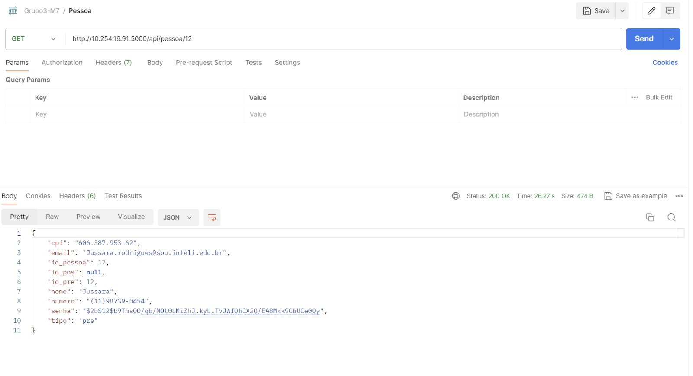
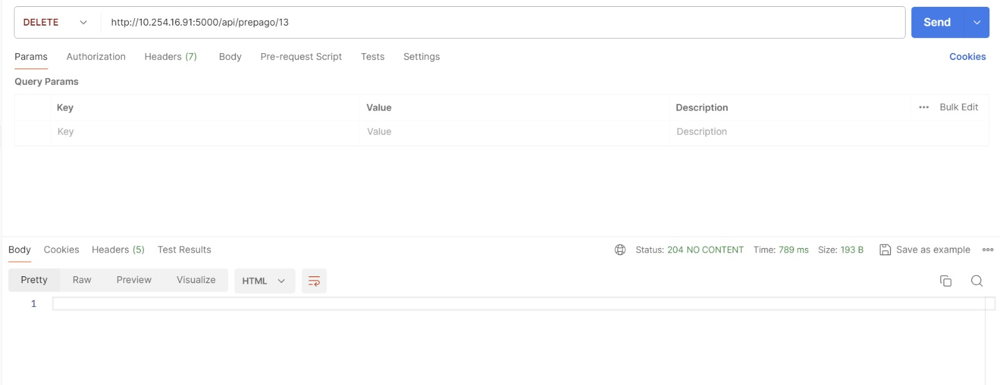

# Teste de MicroServiço

O teste de microserviço é fundamental para garantir que nosso serviço esteja funcionando conforme esperado, assegurando que os dados inseridos ou recuperados estejam corretos. Embora não tenhamos múltiplos microserviços, mas apenas uma API, ainda assim faremos uma abordagem completa na avaliação, testando diversos aspectos desta API.

Dentro da API, temos as classes Pessoa, Pós-pago e Pré-pago, cada uma com suas respectivas funcionalidades e quatro tipos de solicitações comuns: GET, POST, PUT e DELETE.

Observação: Para acessar uma rota específica, é necessário prefixar a rota com "/api/{rota_escolhida}".

## Pessoa

### Get
*Rota acessada: api/pessoa/<int:id_pessoa>*

Descrição: Esta rota é acessada para obter uma pessoa em especifico pelo id presente em nosso banco de dados.

Esperado: Esperamos que ao acessar esta rota utilizando o método GET, todas as informações da Pessoa desejada sejam retornadas.

Resultado: Ao realizar o acesso à rota, obtivemos com sucesso todas as informações desejadas armazenadas no banco de dados.

resultado: Dados obtidos

### Post
*Rota acessada: api/pessoa*
Descrição: Esta rota é utilizada para criar uma nova conta de usuário com os dados básicos, incluindo nome, e-mail, CPF, número de telefone e senha.

Esperado: Esperamos que ao acessar esta rota utilizando o método POST, uma nova conta de usuário seja criada com os dados fornecidos.

Resultado: A operação de criação de usuário foi realizada com sucesso.

### Put
*Rota acessada: api/pessoa/<int:id_pessoa>*

Descrição: Esta rota é utilizada para atualizar os dados de um usuário específico com base em seu ID.

Esperado: Esperamos que ao acessar esta rota utilizando o método PUT, os dados do usuário correspondente sejam atualizados conforme as informações fornecidas.

Resultado: Os dados do usuário foram atualizados com sucesso.

### Delete
*Rota acessada: api/pessoa/<int:id_pessoa>*
Descrição: Esta rota é utilizada para deletar a conta de um usuário com base em seu ID, caso não deseje mais utilizar sua conta.

Esperado: Esperamos que ao acessar esta rota utilizando o método DELETE, a conta do usuário correspondente seja deletada do sistema.

Resultado: A conta do usuário foi deletada com sucesso.

------

## Pré_pago

### Get
*Rota acessada: api/prepagos*
Descrição: Esta rota é utilizada para obter todos os registros de Pré-pago presentes no sistema.

Esperado: Ao acessar esta rota com o método GET, esperamos receber todos os registros de Pré-pago em formato JSON.

Resultado: Dados obtidos com sucesso.

### Put
*Rota acessada: api/prepago/int:id_prepago*
Descrição: Esta rota é utilizada para atualizar os dados de um registro de Pré-pago específico com base em seu ID.

Esperado: Ao acessar esta rota com o método PUT e fornecer o ID do registro a ser atualizado, esperamos que os dados do registro correspondente sejam atualizados conforme as informações fornecidas no corpo da requisição.

Resultado: Dados atualizados com sucesso

### Delete
*Rota acessada: api/prepago/int:id_prepago*
Descrição: Esta rota é utilizada para deletar um registro de Pré-pago específico com base em seu ID.

Esperado: Ao acessar esta rota com o método DELETE e fornecer o ID do registro a ser deletado, esperamos que o registro correspondente seja removido do sistema.

Resultado: Deletado com sucesso

------

## Pós_pago

### Get
*Rota acessada: api/pospagos*

Descrição: Esta rota é utilizada para obter todos os registros de Pós-pago presentes no sistema.

Esperado: Ao acessar esta rota com o método GET, esperamos receber todos os registros de Pós-pago em formato JSON.

Resultado: Dados buscados com sucesso.

### Put
*Rota acessada: api/pospago/int:id_pospago*
Descrição: Esta rota é utilizada para atualizar os dados de um registro de Pós-pago específico com base em seu ID.

Esperado: Ao acessar esta rota com o método PUT e fornecer o ID do registro a ser atualizado, esperamos que os dados do registro correspondente sejam atualizados conforme as informações fornecidas no corpo da requisição.

Resultado: Dados Atualizados com sucesso.

### Delete
*Rota acessada: api/pospago/int:id_pospago*
Descrição: Esta rota é utilizada para deletar um registro de Pós-pago específico com base em seu ID.

Esperado: Ao acessar esta rota com o método DELETE e fornecer o ID do registro a ser deletado, esperamos que o registro correspondente seja removido do sistema.

Resultado: Dados buscados com sucesso.

