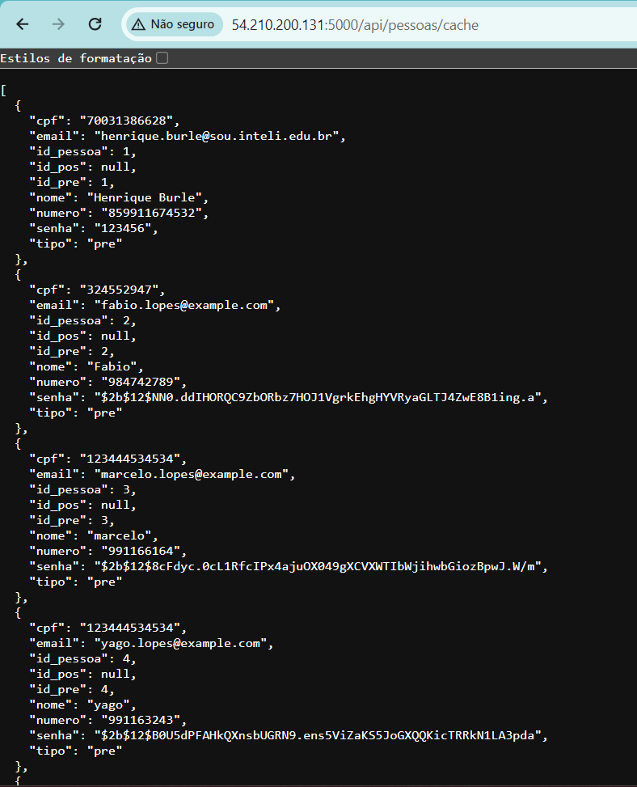
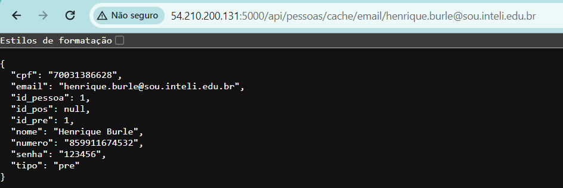
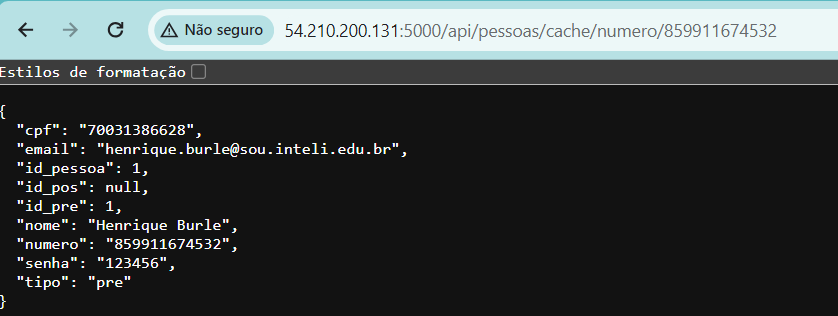
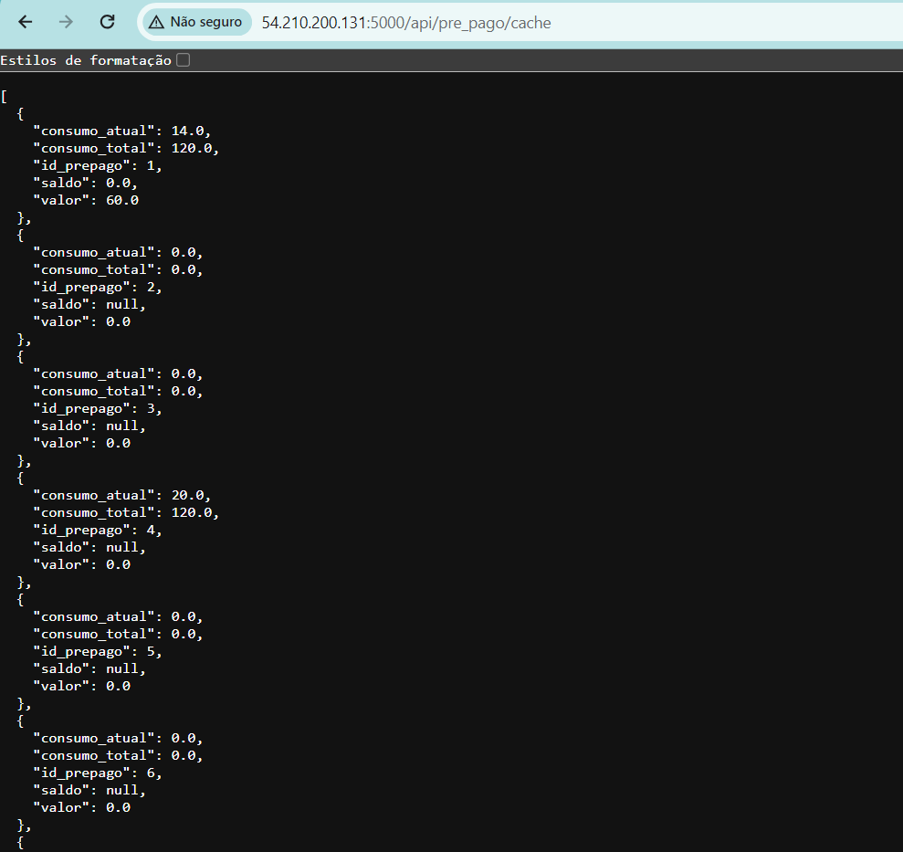
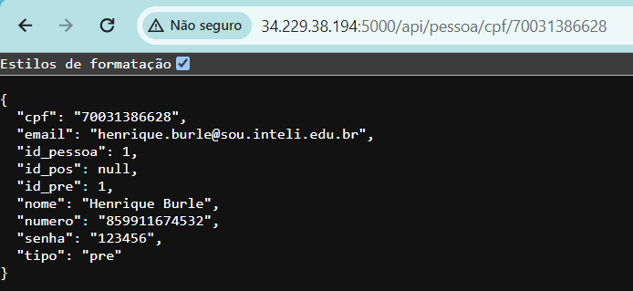
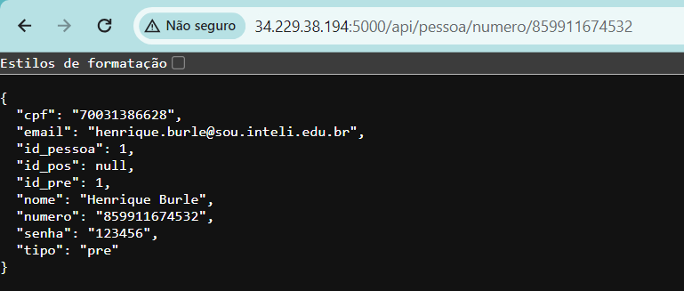
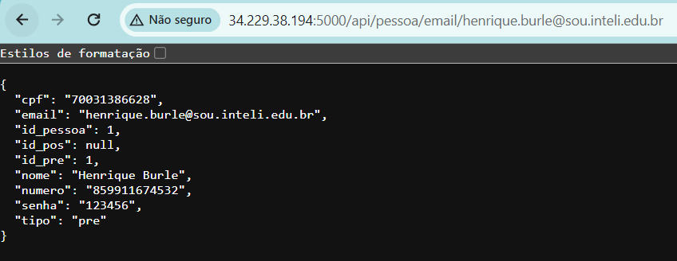

# TESTES UNITÁRIOS

O teste unitário é um componente essencial no desenvolvimento de software, assegurando que cada parte do nosso sistema funcione corretamente de maneira isolada. Mesmo que nosso sistema seja composto apenas por uma API e não por múltiplos microserviços, a aplicação de testes unitários em cada classe e método nos permite identificar e corrigir erros de forma precoce, garantindo a qualidade e a confiabilidade do software.

### Obter Todas as Pessoas Via Cache

- **Rota acessada:** `api/pessoas/cache`
  
- **Descrição:** Esta rota é utilizada para recuperar todas as pessoas cadastradas no sistema, acessando os dados através do cache para uma resposta mais rápida. Ideal para situações onde a atualidade dos dados em tempo real não é crítica e a performance é priorizada.

- **Esperado:** Ao acessar esta rota utilizando o método GET, esperamos que uma lista com todas as pessoas cadastradas seja retornada de forma rápida, utilizando os dados armazenados no cache.

- **Resultado:** Acessando a rota, conseguimos recuperar com sucesso a lista completa de pessoas cadastradas, comprovando a eficiência e a rapidez do cache.

### Pessoa Por Email Via Cache

- **Rota acessada:** `api/pessoa/email/cache/<email_da_pessoa>`

- **Descrição:** Esta rota é destinada a encontrar uma pessoa específica pelo seu e-mail, utilizando os dados armazenados em cache.

- **Esperado:** Utilizando o método GET para acessar esta rota com um e-mail específico, esperamos receber todas as informações pertinentes à pessoa associada a este e-mail, através do cache.

- **Resultado:** Ao realizar a consulta, as informações da pessoa correspondente ao e-mail fornecido foram obtidas com sucesso a partir do cache, demonstrando a eficiência do sistema em fornecer dados rapidamente.

  

  ### Pessoa Por Número Via Cache

- **Rota acessada:** `api/pessoa/numero/cache/<numero_da_pessoa>`

- **Descrição:** A rota é projetada para buscar uma pessoa utilizando seu número de contato como chave, acessando os dados a partir do cache.

- **Esperado:** Espera-se que, ao utilizar o método GET com um número de contato específico, a API retorne rapidamente as informações da pessoa associada a esse número, usando o cache.

- **Resultado:** A consulta foi realizada com êxito, e as informações da pessoa relacionada ao número fornecido foram recuperadas rapidamente do cache, validando a eficácia do método.

  

  ### Todos os Pré-pagos Via Cache

- **Rota acessada:** `api/prepago/cache`

- **Descrição:** Esta rota permite acessar a lista de todos os usuários com planos pré-pagos, utilizando o cache para acelerar a resposta.
- **Esperado:** Ao realizar um GET nesta rota, esperamos obter uma lista completa de todos os usuários com planos pré-pagos, através dos dados disponíveis no cache.

- **Resultado:** O acesso à rota resultou na recuperação bem-sucedida e rápida da lista de usuários pré-pagos, evidenciando a vantagem de usar o cache para consultas de dados frequentes.

  

### Pessoa Por CPF

- **Rota acessada:** `api/pessoa/cpf/<cpf_da_pessoa>`

- **Descrição:** Rota específica para buscar uma pessoa utilizando o CPF como parâmetro de busca. Esta consulta é direta ao banco de dados, garantindo que os dados retornados estejam atualizados.

- **Esperado:** Utilizando o método GET com um CPF específico, a expectativa é que todas as informações relacionadas à pessoa vinculada a este CPF sejam retornadas detalhadamente.

- **Resultado:** A busca pelo CPF resultou no sucesso em encontrar a pessoa correspondente, com todas as informações desejadas sendo precisamente recuperadas do banco de dados.

   

  ### Pessoa Por Número

- **Rota acessada:** `api/pessoa/numero/<numero_da_pessoa>`

- **Descrição:** Utilizada para buscar informações de uma pessoa específica através do seu número de contato. Esta consulta busca os dados diretamente no banco de dados para assegurar a precisão e atualidade das informações.

- **Esperado:** Esperamos que, ao acessar esta rota com um número de contato específico pelo método GET, sejam retornadas todas as informações relevantes da pessoa associada a esse número.

- **Resultado:** A consulta pelo número de contato foi bem-sucedida, recuperando todas as informações necessárias da pessoa relacionada, confirmada pela precisão dos dados obtidos do banco de dados.

    

  ### Pessoa Por Email

- **Rota acessada:** `api/pessoa/email/<email_da_pessoa>`

- **Descrição:** Rota destinada a encontrar uma pessoa específica utilizando seu e-mail como parâmetro. A busca é feita diretamente no banco de dados para garantir a obtenção de dados atualizados e precisos.

- **Esperado:** Ao acessar esta rota com um e-mail específico pelo método GET, esperamos que as informações completas da pessoa relacionada a esse e-mail sejam fornecidas detalhadamente.

- **Resultado:** A busca por e-mail foi realizada com sucesso, permitindo a recuperação eficiente das informações detalhadas da pessoa solicitada, evidenciando a precisão e a eficácia da busca no banco de dados.

    
