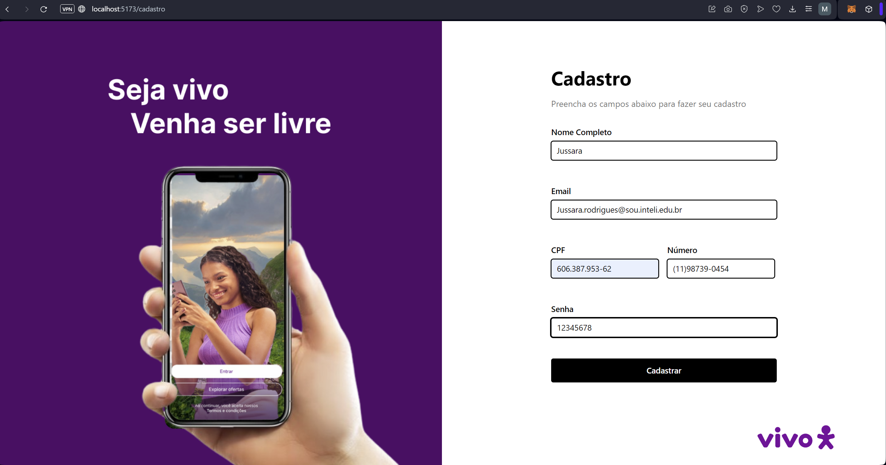
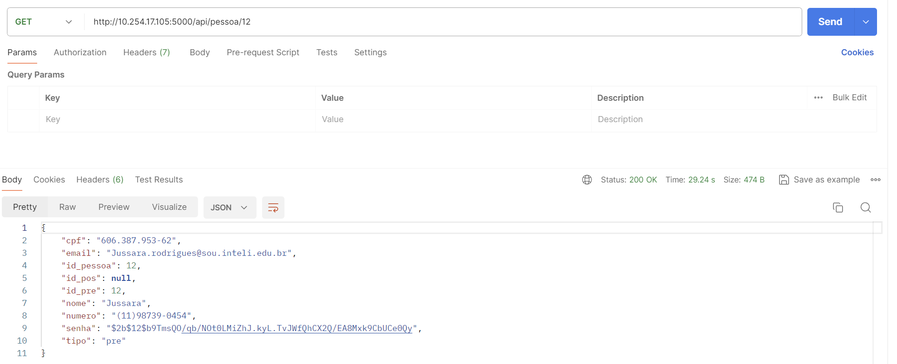
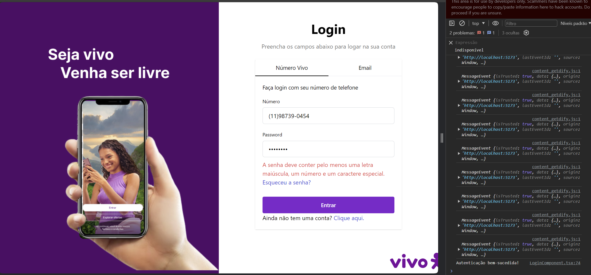
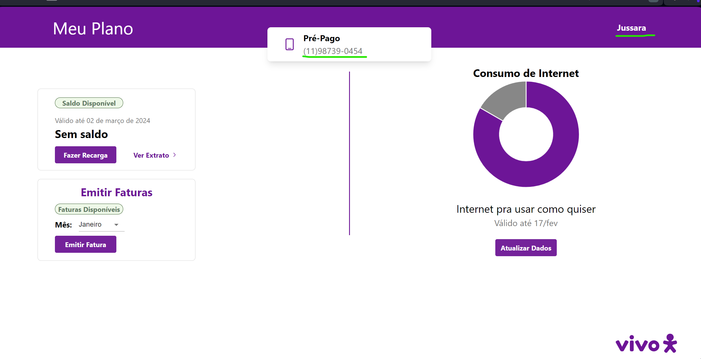
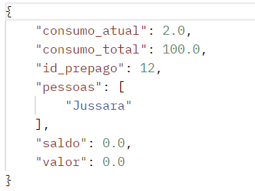
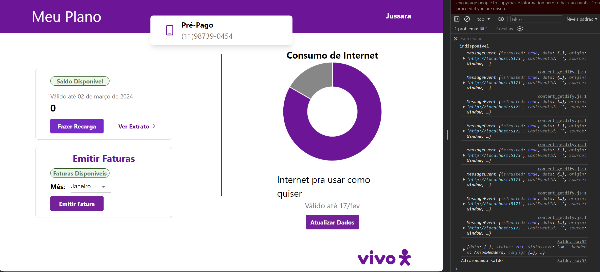
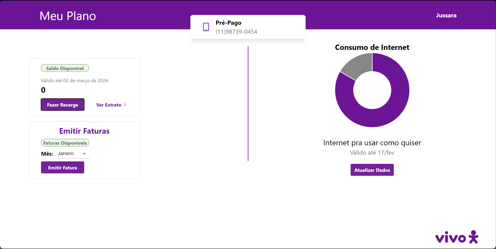
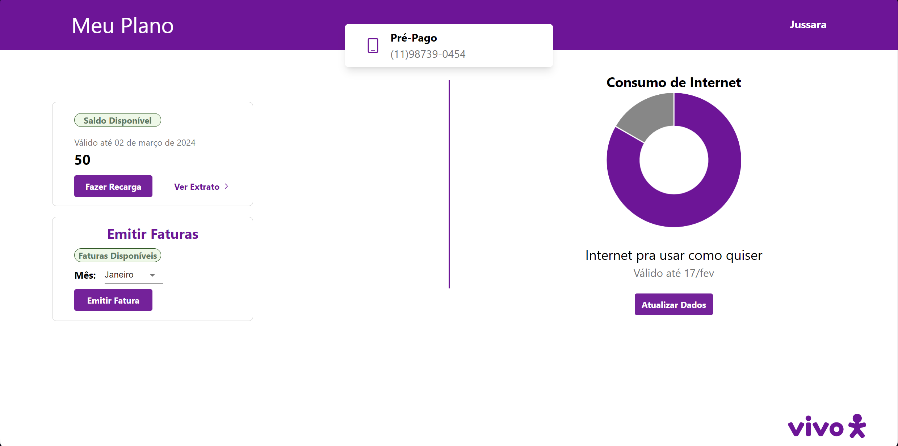
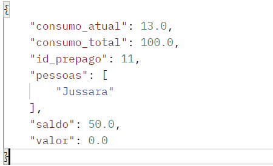

# Testes de Integração
Iremos desenvolver os testes de integração que são testes de software que visam verificar a comunicação e o comportamento de diferentes módulos ou componentes de um sistema quando integrados.

## Objetivo
Nesses testes de integração iremos verificar a integração das páginas Register, Login e Home bem como seus componentes(CadastroComponent,LoginComponent, Saldo, Navbar)

### Página Register

#### Nome do caso: 
Nessa página está sendo utilizado o componente cadastro que utiliza uma requisição POST para o endpoint /api/pessoa.
#### Pré-condições: 
A pré condição para esse caso de teste é que o frontend esteja rodando e esteja aberto no navegador na página /cadastro
#### Entradas: 

Essa foi a entrada inputada no frontend, que irá enviar este json para o backend, que por sua vez adicionará no banco de dados: 
´´´ 
{
    cpf": "606.387.953-62",
    "email": "Jussara.rodrigues@sou.inteli.edu.br",
    "nome": "Jussara",
    "numero": "(11)98739-0454",
    "senha": "12345678"
}
´´´
#### Saídas esperadas: 
É esperado que no banco de dados tenha sido criado o usuário Jussara com as informações do JSON acima, porém com algumas adições, tais quais: id_pessoa, tipo(de plano), id_pre(id do prepago), id_pos(id do pospago) e senha criptografada
#### Passos: 
Para que os testes sejam realizados é necessário adicionar as entradas nos inputs do frontend e clicar em cadastrar
#### Resultados: 
Os resultados reais obtidos após a execução do teste.

#### Critérios de aprovação:
Sendo assim o teste da página Register foi um sucesso, uma vez que o usuário Jussara foi criado da maneira esperada.

### Página LOGIN

#### Nome do caso: 
Nessa página está sendo utilizado o componente login component que utiliza uma requisição POST para o endpoint /api/pessoa/autenticar_numero/${phoneNumber} ou /api/pessoa/autenticar_email/${email} a depender de como o usuário escolherá se logar, no body dessas rotas será enviada apenas a senha. Além disso, o componente LoginComponent faz um GET(apenas se a autenticação for um sucesso) para o endpoint http://10.254.17.105:5000/api/pessoa/numero/${phoneNumber} ou http://10.254.17.105:5000/api/pessoa/email/${email} a depender de como o usuário decidir se logar.
#### Pré-condições: 
A pré condição para esse caso de teste é que o frontend esteja rodando e esteja aberto no navegador na página /login
#### Entradas: 
Escolhemos efetuar login por número

Essa foi a entrada inputada no frontend, que irá enviar este json para o endpoint de autenticação: 
´´´ 
{
    "senha": "12345678"
}
´´´

#### Saídas esperadas: 
Caso a autenticação da senha seja bem sucedida o fronted fará um GET buscando as informações daquele usuário e encaminhado para a página Home , uma das saídas esperadas é a mensagem "Autenticação bem-sucedida!" no Console, após isso ser encaminhado para o endpoint "/"
#### Passos: 
Para que os testes sejam realizados é necessário adicionar as o número (11)98739-0454 e a senha 12345678 no frontend e clicar em "entrar"
#### Resultados: 
Os resultados reais obtidos após a execução do teste.

#### Critérios de aprovação:
Sendo assim o teste da página Login foi um sucesso, uma vez que o usuário Jussara efetuou o login, teve sua senha autenticada e foi encaminhado para a página Home.

### Página Home

#### Nome do caso: 
Nessa página está sendo utilizado os componentes saldo, navbar e a página Home que utilizam uma requisição GET e POST: 
saldo: 
GET: /api/pessoa/${id_pessoa} buscar informações do usuário

GET: /api/prepago/${response.data.id_pre} buscar informações do plano prepago

POST: /api/prepago/adicionar_saldo/${userDataResponse.id_pre} adicionar saldo na conta do usuário
navbar: /api/pessoa/${person_id} busca informações do usuário
Home: /api/prepago/${id} busca informações do plano prepago do usuário
#### Pré-condições: 
A pré condição para esse caso de teste é que o frontend esteja rodando e esteja aberto no navegador na página HOME que tem o endpoint "/"

#### Entradas: 

A única entrada é ter realizado o login no site, como foi descrito no teste anterior
#### Saídas esperadas: 
Saldo: É necessário que mostre o saldo de jussara e seja possível adicionar saldo na sua conta , de forma que após a adição seja mostrado o novo saldo
Home e Navbar: mostrar as informações do usuário jussara
#### Passos: 
1. Ter realizado Login anteriormente
2. Clicar em "Fazer Recarga" 
#### Resultados: 
Os resultados reais obtidos após a execução do teste.
Resultado após a realização do passo 1 
Resultado após a realização do passo 2 
Dados do plano do usuário no banco de dados(saldo foi adicionado) 
#### Critérios de aprovação:
Sendo assim o teste da página Home foi um sucesso, uma vez que foi possível mostrar as informações do usuário e adicionar saldo no plano prepago do usuário.