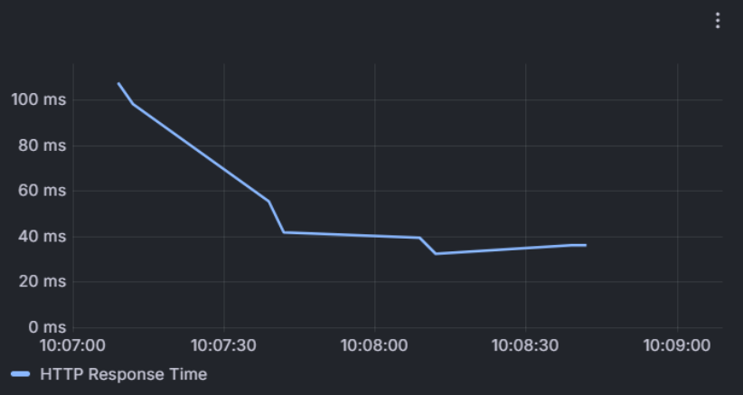
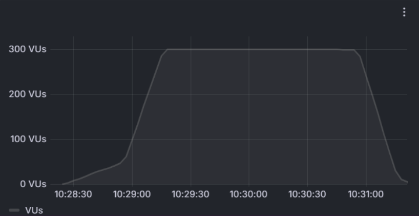
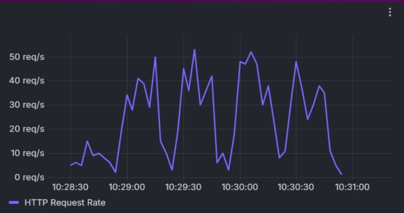

# Testes dos requisitos não-funcionais

#### RNF1:
    O tempo de resposta do sistema deve ser, em média, inferior a 3 segundos.
##### Plano de teste:
    Objetivo: Validar se o tempo de resposta do sistema está inferior a 3 segundos.
###### Metodologia:
    Utilizar uma ferramenta de automação de testes para realizar requisições ao sistema e medir o tempo de resposta.
    Realizar testes em diferentes cenários (ex: carga baixa, carga alta).
###### Critérios de Aceitação:
    O tempo de resposta médio do sistema deve ser inferior a 3 segundos em 90% dos casos.
    O tempo de resposta máximo do sistema não deve ultrapassar 5 segundos em nenhum caso.

###### Teste:

    Durante o teste, o sistema foi submetido a 830 requisições, atingindo um pico de 55.33 requisições por segundo. O tempo de resposta no percentil 95 foi registrado em 113 milissegundos, demonstrando uma resposta rápida mesmo sob carga significativa. Apesar de ter ocorrido um número considerável de falhas HTTP (400 requisições), isso não comprometeu o desempenho geral, mantendo-se bem abaixo do limite de 3 segundos estabelecido.

    A constância dos usuários virtuais (VUs) e a variação no tempo de resposta mostram que o sistema conseguiu lidar eficientemente com o volume de tráfego. O sistema mostrou-se resiliente e eficaz, cumprindo com os critérios de aceitação e mantendo um tempo de resposta que atende às especificações de desempenho sob diferentes cenários de carga.

    Conclui-se que o sistema atende ao requisito não funcional RNF1, mantendo um tempo de resposta médio abaixo de 3 segundos e um tempo máximo que não excede 5 segundos, mesmo considerando as falhas observadas.

#### RNF2:
    Os usuários devem conseguir se autenticarem utilizando seus repectivos CPF, número de telefone ou e-mail.
##### Plano de teste:
    Objetivo: Validar se os usuários conseguem se autenticar utilizando seus respectivos CPF, número de telefone ou e-mail.
###### Metodologia:
    Realizar testes manuais de autenticação com diferentes combinações de CPF, número de telefone e e-mail.
    Testar a autenticação em diferentes cenários (ex: usuário inexistente).
###### Critérios de Aceitação:
    O usuário deve conseguir se autenticar com sucesso utilizando seus dados corretos.
    O sistema deve apresentar mensagens de erro claras e informativas em caso de falha na autenticação.

###### Teste:
Começando pelo cadastro, foram realizados testes com informações que não poderiam estar corretas nos campos, para validar a presença das máscaras. Nenhuma das operações intencionalmente equivocadas passou. No caso de email e número de telefone, as máscaras são relativas ao formato, mas no caso do cpf há uma validação a mais, se aquele número pode matematicamente ser um cpf, seguindo a fórmula da Receita Federal. Aqui está um exemplo do funcionamento das máscaras no cadastro.

Agora para o caso do login, ainda não foi implementado um sistema de autenticação robusto, então a validação que ocorre é relativa à existência ou não da conta.
Uma vez inseridos os dados corretos, o login ocorreu sem problemas, garantindo o critério de aceitação do teste. Abaixo estão os prints do processo de login.

#### RNF3:
    A interface do sistema deve ser de fácil entendimento e utilização.
##### Plano de teste:
    Objetivo: Validar se a interface do sistema é de fácil entendimento e utilização.
###### Metodologia:
    Realizar testes de usabilidade com usuários reais do sistema.
Observar a interação dos usuários com o sistema e identificar pontos de melhoria.
    Coletar feedback dos usuários sobre a usabilidade da interface.
###### Critérios de Aceitação:
    A interface do sistema deve ser intuitiva e fácil de usar.
    Os usuários devem conseguir realizar as tarefas desejadas sem dificuldades.
    O sistema deve apresentar mensagens de ajuda e instruções claras para os usuários.

###### Teste:
A documentação dos testes está na pasta docs, no arquivo testes_de_usabilidade.xlsx.
Seguem as principais conclusões tiradas dos testes: 
Cadastro: 
É necessário pedir ao usuário para cadastrar uma senha. 
Poderia já logar o usuário e levá-lo à home quando concluído. 
Login: 
Precisa haver uma validação para que o usuário não consiga entrar em uma conta inexistente. 
Home: 
A data de validade do saldo disponível deve fazer sentido, e não ser um número fixo arbitrário. 
Deve ser adicionada a função de emitir fatura, que por enquanto não está funcionando.

Apesar da necessidade de implementação dessas melhorias, todos os usuários conseguiram realizar, relativamente sem dificuldades, as etapas pedidas (cadastro, login e entendimento da home), o que está de acordo com o critério de aceitação do teste. O sistema também dava instruções claras do que precisava ser corrigido quando o usuário cometia um erro, como inserir um cpf errado, o que também está de acordo com o critério de aceitação.

#### RNF4:
    O banco de dados deve ser criado na AWS RDS e deve ter um delay de aproximadamente 30 segundos, para simular os bancos legados da Vivo.
##### Plano de teste:
    Objetivo: Validar se o banco de dados está funcionando de acordo com o esperado.
###### Metodologia:
    Utilizar uma ferramenta de monitoramento de desempenho para verificar o tempo de resposta das queries ao banco de dados.
    Realizar testes de carga no banco de dados para avaliar sua capacidade de lidar com um grande número de requisições.
###### Critérios de Aceitação:
    O tempo de resposta das queries ao banco de dados deve ser inferior a 30 segundos em 90% dos casos.
    O banco de dados deve ser capaz de lidar com um grande número de requisições sem apresentar falhas

###### Teste:
Será testado quando o cache for implementado

#### RNF 5
    O sistema deve estar disponível 99.9% do tempo.
##### Plano de teste:
    Objetivo: Validar se o sistema está disponível 99.9% do tempo.
###### Metodologia:
    Utilizar uma ferramenta de monitoramento de tempo de atividade para monitorar a disponibilidade do sistema.
    Coletar dados sobre o tempo de atividade do sistema por um período significativo de tempo (ex: um mês).
###### Critérios de Aceitação:
    O sistema deve estar disponível 99.9% do tempo.
    O tempo de inatividade do sistema não deve ultrapassar o limite especificado.

###### Teste:
Será testado quando o sistema estiver continuamente disponível

#### RNF 6
    O sistema deve ser elástico para suportar picos de demanda.
##### Plano de teste:
    Objetivo: Validar se o sistema é capaz de suportar picos de demanda.
###### Metodologia:
    Utilizar uma ferramenta de teste de carga para simular um grande número de requisições simultâneas ao sistema.
    Monitorar o desempenho do sistema durante a realização dos testes.
    Verificar se o sistema consegue escalar horizontalmente para acomodar o aumento da carga.
###### Critérios de Aceitação:
    O sistema deve manter o tempo de resposta adequado mesmo sob alta carga.
    O sistema não deve apresentar falhas ou erros durante a realização dos testes.
    O sistema deve ser capaz de escalar horizontalmente para aumentar sua capacidade.

###### Teste:

    O teste de carga visou validar a elasticidade do sistema ao suportar picos de demanda. Foram realizadas 2.5K requisições, com um pico de 34.33 requisições por segundo e um tempo de resposta de 27 ms no 95º percentil, demonstrando alta capacidade de processamento sob estresse. Houve 1.2K falhas HTTP, o que é aceitável no contexto de teste com máquinas virtuais, onde se espera um número maior de falhas devido à intensidade das requisições.

    Os gráficos evidenciam que o sistema manteve a performance diante do aumento progressivo de usuários virtuais até 300, gerenciando o tráfego eficientemente. Mesmo com variações na taxa de requisições, o tempo de resposta se manteve estável, exceto por picos isolados.

    Conclui-se que o sistema atende ao requisito de elasticidade, mantendo a performance e a estabilidade em cenários de alta demanda e demonstrando a capacidade de escalabilidade horizontal. Os critérios de aceitação foram atendidos, confirmando o sucesso do teste.

